# ERI Visualization System — Implementation Plan (v1.2)

## 🚨 CRITICAL MAMMOTH INTEGRATION REQUIREMENTS

**MANDATORY**: Every task MUST integrate with existing Mammoth Einstellung infrastructure:

### Existing Components to Use (DO NOT RECREATE):

- **`datasets/seq_cifar100_einstellung_224.py`**: ViT-compatible dataset with patch injection
- **`utils/einstellung_evaluator.py`**: Plugin-based evaluator with timeline tracking
- **`utils/attention_visualization.py`**: ViT attention analysis capabilities
- **Mammoth training pipeline**: Hooks, logging, checkpoint management
- **Existing experiment runners**: Checkpoint management and orchestration

### Integration Points:

- **Data Loading**: Convert `EinstellungEvaluator.export_results()` format to visualization format
- **Evaluation**: Hook into existing `after_training_epoch()` and `meta_end_task()` callbacks
- **Methods**: Support all Mammoth strategies (SGD, EWC, DER++, etc.) without modification
- **Datasets**: Use existing `get_evaluation_subsets()` for T1_all, T2_shortcut_normal, etc.
- **Attention**: Integrate with existing `EinstellungAttentionAnalyzer` for ViT models

**FAILURE TO INTEGRATE = TASK FAILURE**

## Implementation Conventions

- Code style: black/PEP8 formatting with type hints and comprehensive docstrings
- Output directories auto-created with deterministic file naming
- All modules under `eri_vis/` package with corresponding tests under `tests/eri_vis/`
- Each task builds incrementally on previous tasks with clear interfaces
- ESSENTIAL COMPLIANCE: MUST BE COMPREHENSIVE. MUST FOLLOW BEST SCIENTIFIC EXPERIMENT DESIGN PRACTICES - specifically the existing project structure of MAMMOTH (this repo).

## Task Organization

Tasks are organized into logical phases with clear dependencies. Each task includes specific files to create, implementation details, and definition of done criteria.

---

## Phase 1: Core Data Infrastructure

- [x] **1. ERIDataLoader — Data Loading and Validation Foundation**

  - Files: eri_vis/data_loader.py, tests/eri_vis/test_data_loader.py
  - Implement:
    - load_csv(filepath): parse, validate REQUIRED_COLS and VALID_SPLITS
    - load_from_evaluator_export(export: dict): **MUST** convert `utils/einstellung_evaluator.py` export format to ERITimelineDataset
    - load_from_mammoth_results(results_dir): scan for JSON files from Mammoth experiments
    - validate_format(df): types, ranges, domain checks; raise on fail
    - convert_legacy_format(legacy): map legacy keys → schema
  - DoD:
    - Unit tests cover: good CSV, missing columns, bad types, unknown splits
    - Detailed error messages show row/col and sample offending entries
    - CSV parsing with validation for required columns: method, seed, epoch_eff, split, acc
    - Support for valid splits: T1_all, T2_shortcut_normal, T2_shortcut_masked, T2_nonshortcut_normal
    - Converter from EinstellungEvaluator export format to CSV schema
    - Detailed error messages with row/column context for validation failures
  - _Requirements: 1.3.1, 1.3.4, 2.1.6_

- [x] **2. ERITimelineDataset — Core Data Structure and Manipulation**

  - Files: eri_vis/dataset.py, tests/eri_vis/test_dataset.py
  - Implement:
    - Filtering by method/seed/split
    - align_epochs(common_epochs): returns new dataset aligned to grid
    - export_csv(path): deterministic ordering; include metadata sidecar JSON
  - DoD:
    - Alignment tests with uneven epoch grids
    - Deterministic export verified by file hash
    - Dataset class with filtering capabilities by method, seed, and split
    - Epoch alignment functionality for cross-method comparisons
    - Deterministic CSV export with metadata sidecar JSON generation
    - Alignment handles uneven epoch grids correctly
  - _Requirements: 1.3.1, 2.1.3, 2.3.1_

- [x] **3. ERITimelineProcessor — Metric Calculations and Analysis**
  - Files: eri_vis/processing.py, tests/eri_vis/test_processing.py
  - Implement:
    - Smoothing (window w, edge-padded)
    - Accuracy curves with mean and 95% CI (t-interval)
    - AD computation with first crossing; NaN if censored
    - PD_t(e) and SFR_rel(e) time series via aligned epochs
  - DoD:
    - Synthetic curves with known AD/PD_t/SFR_rel values pass tests
    - Censored runs produce NaN AD and warnings
    - Smoothing with configurable window size and edge padding
    - Accuracy curves with mean and 95% confidence intervals using t-distribution
    - Adaptation Delay (AD) with first threshold crossing detection
    - Performance Deficit (PD_t) and Shortcut Forgetting Rate (SFR_rel) time series
    - Handle censored runs by marking AD as NaN with appropriate warnings
  - _Requirements: 1.1.2, 1.2.4, 2.1.1, 2.1.2_

---

## Phase 2: Visualization Engine

- [x] **4. Plot Style Configuration — Visual Styling System**

  - Files: eri_vis/styles.py, tests/eri_vis/test_styles.py
  - Implement PlotStyleConfig with defaults and overrides
  - DoD:
    - Styles load; custom palette applies; DPI configurable
    - PlotStyleConfig class with sensible defaults for colors, fonts, and layout
    - Support custom color palettes for different methods
    - Make DPI and figure dimensions configurable
  - _Requirements: 1.1.3, 1.6.2, 2.2.3_

- [x] **5. ERIDynamicsPlotter — Main Visualization Generator**

  - Files: eri_vis/plot_dynamics.py, tests/eri_vis/test_plot_dynamics.py
  - Implement 3-panel figure:
    - Panel A: patched curves with CI; AD markers and "AD=x.x" annotations
    - Panel B: PD_t(e) curves; zero line; legend
    - Panel C: SFR_rel(e) curves; zero line; legend
  - DoD:
    - Saves to PDF; size < 5 MB
    - Visual regression test against golden image (mock data)
    - 3-panel figure layout with proper spacing and labels
    - Panel A: Accuracy trajectories with confidence intervals and AD markers
    - Panel B: Performance Deficit (PD_t) time series with zero reference line
    - Panel C: Shortcut Forgetting Rate (SFR_rel) time series with zero reference line
    - Generate publication-ready PDF output under 5MB file size
    - Include visual regression testing with golden reference images
  - _Requirements: 1.1.1, 1.1.2, 1.1.3, 1.1.4_

- [x] **6. ERIHeatmapPlotter — Robustness Analysis Visualization**

  - Files: eri_vis/plot_heatmap.py, tests/eri_vis/test_heatmap.py
  - Implement AD(τ) heatmap vs Scratch_T2:
    - Diverging colormap centered at 0.0
    - Annotated cells; NaN cells shown with hatch/blank
  - DoD:
    - Heatmap generated with synthetic sensitivity matrix
    - AD(τ) sensitivity heatmap comparing methods to Scratch_T2 baseline
    - Use diverging colormap centered at zero for intuitive interpretation
    - Handle NaN values with appropriate visual indicators (hatching or blanks)
    - Add cell annotations with AD values for precise reading
  - _Requirements: 1.2.1, 1.2.2, 1.2.3, 1.2.4_

- [x] **7. CLI Interface — Command-Line Tool**
  - Files: tools/plot_eri.py, tests/eri_vis/test_cli.py
  - Implement argparse:
    - --csv (glob allowed), --outdir, --methods, --tau, --smooth, --tau_grid
    - Batch mode: multiple CSVs; aggregate/write per-run outputs
    - Progress logging; clear errors for bad CSV
  - DoD:
    - Example commands in README run end-to-end on sample CSV
    - Argument parsing for CSV input, output directory, method selection
    - Support batch processing with glob patterns for multiple CSV files
    - Configuration options for tau threshold, smoothing window, and tau grid
    - Progress logging and clear error messages for invalid inputs
    - Example commands that work end-to-end with sample data
  - _Requirements: 1.6.1, 1.6.3, 1.6.4, 1.6.5_

---

## Phase 3: Mammoth Framework Integration

- [x] **8. MammothERIIntegration — Framework Bridge**

  - Files: eri_vis/integration/mammoth_integration.py, tests/eri_vis/test_mammoth_integration.py
  - **CRITICAL**: Integrate with existing `utils/einstellung_evaluator.py` - DO NOT RECREATE
  - Implement:
    - setup_auto_export(output_dir, export_frequency): Hook into existing evaluator
    - export_timeline_for_visualization(filepath): Convert existing export format
    - generate_visualizations_from_evaluator(output_dir): Use existing evaluator data
    - register_visualization_hooks(): Extend existing `after_training_epoch()` hooks
  - DoD:
    - Integration test with **REAL** EinstellungEvaluator (not mock) exporting CSV and figs
    - Automatic export setup with configurable frequency using existing hooks
    - Timeline data export functionality using existing evaluator export format
    - Visualization generation from existing evaluator data structure
    - Register visualization hooks with existing Mammoth `meta_begin_task()`, `after_training_epoch()`, `meta_end_task()` infrastructure
    - Test integration with actual EinstellungEvaluator to verify CSV and figure generation
  - _Requirements: 1.4.1, 1.4.2, 1.4.3_

- [x] **9. ERIExperimentHooks — Experiment Lifecycle Integration**

  - Files: eri_vis/integration/hooks.py
  - Implement callbacks:
    - on_epoch_end(epoch, evaluator): collect SC patched/masked accuracies
    - on_task_end(task_id, evaluator): flush partial exports
    - on_experiment_end(evaluator): final export + figs
  - DoD:
    - Hooks invoked in runner; produce logs/eri_sc_metrics.csv
    - Epoch-end callback to collect shortcut patched and masked accuracies
    - Task-end callback for partial data export and cleanup
    - Experiment-end callback for final export and visualization generation
    - Ensure hooks produce properly formatted `logs/eri_sc_metrics.csv` output
  - _Requirements: 1.4.1, 1.4.2_

- [x] **10. Runner and Configuration — End-to-End Pipeline** ✅ COMPLETED

  - Files: experiments/runners/run_einstellung.py, experiments/configs/cifar100_einstellung224.yaml
  - **CRITICAL**: Use existing Mammoth infrastructure - extend `run_einstellung_experiment.py` if it exists
  - Implement:
    - Read config; initialize Mammoth with existing `datasets/seq_cifar100_einstellung_224.py`
    - Register hooks with existing `utils/einstellung_evaluator.py`
    - Use existing `get_evaluation_subsets()` for T1_all, T2_shortcut_normal, T2_shortcut_masked, T2_nonshortcut_normal
    - Leverage existing checkpoint management and experiment orchestration
  - DoD: ✅ ALL COMPLETED
    - ✅ Single-run pipeline produces both CSV and PDFs using existing Mammoth components
    - ✅ Configuration parsing and Mammoth initialization with existing dataset
    - ✅ Register visualization hooks with existing EinstellungEvaluator training pipeline
    - ✅ Ensure all required splits from existing `get_evaluation_subsets()` are evaluated per effective epoch in Phase 2
    - ✅ Verify end-to-end pipeline produces both CSV data and PDF visualizations using existing infrastructure
  - _Requirements: 1.4.3, 1.4.4_

  **IMPLEMENTATION STATUS:** Successfully extended `(root)/run_einstellung_experiment.py` with ERI visualization integration. The pipeline is working correctly with:

  - ✅ EinstellungEvaluator integration active
  - ✅ All required evaluation subsets configured and running
  - ✅ AttentionAnalyzer initialized for ViT models
  - ✅ Training pipeline with hooks registered successfully
  - ✅ Checkpoint management and experiment orchestration working

---

## Phase 4: Custom Method Implementation

- [ ] **11. Enhanced DER++ Method — Advanced Replay Strategy**

  - Files: models/enhanced_derpp.py, configs/enhanced_derpp.yaml, tests/models/test_enhanced_derpp.py
  - Implement enhanced DER++ with improved replay mechanisms:
    - Adaptive buffer management with importance-based sampling
    - Dynamic replay ratio based on forgetting detection
    - Enhanced distillation loss with temperature scheduling
    - Memory-efficient buffer updates with gradient-based selection
  - DoD:
    - Method integrates seamlessly with existing Mammoth ContinualModel framework
    - Configuration file supports all enhanced parameters
    - Method appears automatically in ERI visualization outputs
    - Performance improvements demonstrated on CIFAR-100 Einstellung dataset
    - Unit tests verify correct buffer management and replay mechanisms
    - Integration test confirms ERI metrics (AD, PD_t, SFR_rel) are computed correctly
  - _Requirements: 1.7.1, 1.7.2, 1.7.4, 1.8.1_

- [ ] **12. Adaptive EWC Method — Dynamic Regularization**

  - Files: models/adaptive_ewc.py, configs/adaptive_ewc.yaml, tests/models/test_adaptive_ewc.py
  - Implement adaptive EWC with dynamic importance weighting:
    - Adaptive lambda scheduling based on task similarity
    - Importance decay for older tasks to prevent over-regularization
    - Fisher information matrix updates with momentum
    - Task-specific regularization strength adjustment
  - DoD:
    - Method extends existing EWC implementation with adaptive features
    - Configuration supports adaptive parameters and scheduling options
    - Method automatically included in visualization pipeline without code changes
    - Demonstrates improved performance on shortcut learning scenarios
    - Unit tests verify Fisher information computation and lambda adaptation
    - Integration test confirms proper ERI evaluation across all required splits
  - _Requirements: 1.7.1, 1.7.3, 1.7.4, 1.8.2_

- [ ] **13. Custom Method Registry — Method Management System**

  - Files: models/custom_methods/**init**.py, models/custom_methods/registry.py, tests/models/test_registry.py
  - Implement method registration and discovery system:
    - Automatic method discovery and registration
    - Configuration-based method instantiation
    - Method metadata and documentation system
    - Integration with existing Mammoth model loading
  - DoD:
    - Registry automatically discovers and registers custom methods
    - Methods can be configured through YAML files
    - Integration with existing `get_model()` function in Mammoth
    - Method metadata includes description, parameters, and requirements
    - Unit tests verify registration and instantiation processes
    - Documentation explains how to add new custom methods
  - _Requirements: 1.7.1, 1.7.2, 1.7.3_

---

## Phase 5: System Robustness and Performance

- [ ] **14. Error Handling — Comprehensive Exception Management**

  - Files: eri_vis/errors.py, tests/eri_vis/test_errors.py
  - Implement ERIErrorHandler with categorized exceptions and recovery tips
  - DoD:
    - Errors provide actionable messages; tests cover key failure modes
    - ERIErrorHandler with categorized exception types
    - Actionable error messages with recovery suggestions
    - Cover key failure modes: data validation, processing errors, visualization failures
    - Include structured logging with method, seed, and epoch context
  - _Requirements: 2.1.1, 2.1.2, 2.1.6_

- [ ] **15. Performance Optimizations — Scalability and Speed**

  - Files: eri_vis/utils.py (caching), plot modules (parallel)
  - Implement:
    - Optional caching of computed curves (pickle) with checksum of CSV
    - Parallel heatmap computation across methods (if many)
  - DoD:
    - Batch processing of 5 runs < 30s on typical workstation
    - Optional curve computation caching with CSV checksum validation
    - Parallel processing support for batch heatmap generation
    - Optimize memory usage for large datasets with chunked processing
    - Ensure batch processing of 5 runs completes under 30 seconds
  - _Requirements: 2.2.1, 2.2.2, 2.2.5_

- [ ] **16. Documentation — Comprehensive User Guide**
  - Files: docs/README_eri_vis.md
  - Include:
    - Reviewer point notes (1–3) with future work (ImageNet-100, text CL)
    - Sensitivity protocol and AD(τ) reference
    - Method-agnostic claims and instructions
    - Example commands and troubleshooting
  - DoD:
    - Doc reviewed; examples reproducible
    - Complete user guide addressing reviewer feedback points
    - Future work sections for generalizability improvements
    - Sensitivity analysis protocol and AD(τ) methodology documentation
    - Method-agnostic usage instructions and examples
    - Troubleshooting guide with common issues and solutions
    - All example commands are reproducible with sample data
  - _Requirements: 1.5.1, 1.5.2, 1.5.3_

---

## Phase 6: Enhanced Experimental Coverage (Optional)

- [ ] **17. Additional Baseline Methods — Extended Method Support**

  - Add derpp and gmp configs to experiments/configs/
  - Ensure evaluator exports compatible CSV
  - DoD:
    - Runs appear in figs and heatmap by method key
    - Configuration files for DER++ and GPM methods in `experiments/configs/`
    - Evaluator exports maintain CSV compatibility across all methods
    - Verify new methods appear correctly in generated figures and heatmaps
  - _Requirements: 1.3.2, 4.2_

- [ ] **18. Dataset Variant Support — Enhanced Experimental Scope**

  - Add shortcut salience and location sweeps in config
  - Optional: imagenet100_einstellung.yaml, text_sst2_imdb.yaml
  - DoD:
    - Runs generate stronger, more persuasive visuals
    - Shortcut salience and location sweep configurations
    - Optional configurations for ImageNet-100 and text continual learning
    - Variant experiments generate more compelling visual evidence
    - Support different patch sizes, locations, and injection ratios
  - _Requirements: 4.1, 4.4_

- [ ] **19. Supplementary Analysis Tools — Advanced Metrics**
  - ECE under masking (SC) and simple CKA drift computation utilities
  - DoD:
    - Optional plots generated if data available; do not block core figs
    - Expected Calibration Error (ECE) computation under masking
    - Centered Kernel Alignment (CKA) drift analysis utilities
    - Generate optional supplementary plots when data is available
    - Ensure supplementary analyses do not block core visualization generation
  - _Requirements: 4.3_

---

## Success Criteria

The implementation is complete when:

- Publication-ready figures are generated: `fig_eri_dynamics.pdf` and `fig_ad_tau_heatmap.pdf`
- CSV validation and evaluator export work seamlessly with deterministic outputs
- Missing and censored data are handled robustly with clear user warnings
- Performance constraints are met: visualization generation under 30 seconds
- Documentation addresses all reviewer feedback points comprehensively
- All unit and integration tests pass with visual regression validation

## Task Dependencies and Execution Order

```mermaid
graph TD
    A[1. ERIDataLoader ✅] --> B[2. ERITimelineDataset ✅]
    B --> C[3. ERITimelineProcessor ✅]

    D[4. PlotStyleConfig ✅] --> E[5. ERIDynamicsPlotter ✅]
    D --> F[6. ERIHeatmapPlotter ✅]
    C --> E
    C --> F

    E --> G[7. CLI Interface ✅]
    F --> G

    C --> H[8. MammothERIIntegration ✅]
    H --> I[9. ERIExperimentHooks ✅]
    I --> J[10. Runner and Config ✅]

    J --> K[11. Enhanced DER++]
    J --> L[12. Adaptive EWC]
    K --> M[13. Custom Method Registry]
    L --> M

    M --> N[14. Error Handling]
    N --> O[15. Performance Optimizations]
    O --> P[16. Documentation]

    P --> Q[17. Additional Baselines]
    P --> R[18. Dataset Variants]
    P --> S[19. Supplementary Analysis]
```

## Implementation Strategy

**Phase 1 (Tasks 1-3)** ✅ COMPLETED: Established the core data processing foundation. These tasks were completed sequentially as each builds on the previous one.

**Phase 2 (Tasks 4-7)** ✅ COMPLETED: Built the visualization engine. Tasks 5-6 were developed in parallel once task 3 was complete.

**Phase 3 (Tasks 8-10)** ✅ COMPLETED: Successfully integrated with the existing Mammoth framework by extending `run_einstellung_experiment.py`. The end-to-end pipeline is working correctly.

**Phase 4 (Tasks 11-13)**: Implement custom continual learning methods. These tasks focus on:

- Enhanced DER++ with advanced replay strategies
- Adaptive EWC with dynamic regularization
- Method registry system for easy integration

**Phase 5 (Tasks 14-16)**: Polish and optimize the system. These can be done incrementally alongside Phase 4.

**Phase 6 (Tasks 17-19)**: Optional enhancements that strengthen the empirical story and address reviewer concerns.

## Key Implementation Notes

- Start with the data processing foundation (tasks 1-3) before moving to visualization
- Visualization components (tasks 5-6) can be developed in parallel once data processing is ready
- Integration tasks (8-10) require careful coordination with existing Mammoth infrastructure
- Performance and robustness tasks (11-12) should be considered throughout development
- Documentation (task 13) should be updated incrementally as features are completed
- Optional enhancements (14-16) provide additional value but should not block core functionality

This implementation plan provides a coding agent with everything needed: exact schemas, file layout, APIs, algorithms, CLI, error modes, tests, and experiment enhancements to strengthen the paper's empirical story while directly addressing the reviewer's points in the codebase.
