# ERI Visualization System — Implementation Plan (v1.2)

## 🚨 CRITICAL MAMMOTH INTEGRATION REQUIREMENTS

**MANDATORY**: Every task MUST integrate with existing Mammoth Einstellung infrastructure:

### Existing Components to Use (DO NOT RECREATE):

- **`datasets/seq_cifar100_einstellung_224.py`**: ViT-compatible dataset with patch injection
- **`utils/einstellung_evaluator.py`**: Plugin-based evaluator with timeline tracking
- **`utils/attention_visualization.py`**: ViT attention analysis capabilities
- **Mammoth training pipeline**: Hooks, logging, checkpoint management
- **Existing experiment runners**: Checkpoint management and orchestration

### Integration Points:

- **Data Loading**: Convert `EinstellungEvaluator.export_results()` format to visualization format
- **Evaluation**: Hook into existing `after_training_epoch()` and `meta_end_task()` callbacks
- **Methods**: ESSENTIAL(!!) Support all Mammoth strategies (SGD, EWC, DER++, etc.) without modification
- **Datasets**: Use existing `get_evaluation_subsets()` for T1_all, T2_shortcut_normal, etc.
- **Attention**: Integrate with existing `EinstellungAttentionAnalyzer` for ViT models

**FAILURE TO INTEGRATE = TASK FAILURE**

## Implementation Conventions

- Code style: black/PEP8 formatting with type hints and comprehensive docstrings
- Output directories auto-created with deterministic file naming
- All modules under `eri_vis/` package with corresponding tests under `tests/eri_vis/`
- Each task builds incrementally on previous tasks with clear interfaces
- ESSENTIAL COMPLIANCE: MUST BE COMPREHENSIVE. MUST FOLLOW BEST SCIENTIFIC EXPERIMENT DESIGN PRACTICES - specifically the existing project structure of MAMMOTH (this repo).

## Task Organization

Tasks are organized into logical phases with clear dependencies. Each task includes specific files to create, implementation details, and definition of done criteria.

---

## Phase 1: Core Data Infrastructure

- [x] **1. ERIDataLoader — Data Loading and Validation Foundation**

  - Files: eri_vis/data_loader.py, tests/eri_vis/test_data_loader.py
  - Implement:
    - load_csv(filepath): parse, validate REQUIRED_COLS and VALID_SPLITS
    - load_from_evaluator_export(export: dict): **MUST** convert `utils/einstellung_evaluator.py` export format to ERITimelineDataset
    - load_from_mammoth_results(results_dir): scan for JSON files from Mammoth experiments
    - validate_format(df): types, ranges, domain checks; raise on fail
    - convert_legacy_format(legacy): map legacy keys → schema
  - DoD:
    - Unit tests cover: good CSV, missing columns, bad types, unknown splits
    - Detailed error messages show row/col and sample offending entries
    - CSV parsing with validation for required columns: method, seed, epoch_eff, split, acc
    - Support for valid splits: T1_all, T2_shortcut_normal, T2_shortcut_masked, T2_nonshortcut_normal
    - Converter from EinstellungEvaluator export format to CSV schema
    - Detailed error messages with row/column context for validation failures
  - _Requirements: 1.3.1, 1.3.4, 2.1.6_

- [x] **2. ERITimelineDataset — Core Data Structure and Manipulation**

  - Files: eri_vis/dataset.py, tests/eri_vis/test_dataset.py
  - Implement:
    - Filtering by method/seed/split
    - align_epochs(common_epochs): returns new dataset aligned to grid
    - export_csv(path): deterministic ordering; include metadata sidecar JSON
  - DoD:
    - Alignment tests with uneven epoch grids
    - Deterministic export verified by file hash
    - Dataset class with filtering capabilities by method, seed, and split
    - Epoch alignment functionality for cross-method comparisons
    - Deterministic CSV export with metadata sidecar JSON generation
    - Alignment handles uneven epoch grids correctly
  - _Requirements: 1.3.1, 2.1.3, 2.3.1_

- [x] **3. ERITimelineProcessor — Metric Calculations and Analysis**
  - Files: eri_vis/processing.py, tests/eri_vis/test_processing.py
  - Implement:
    - Smoothing (window w, edge-padded)
    - Accuracy curves with mean and 95% CI (t-interval)
    - AD computation with first crossing; NaN if censored
    - PD_t(e) and SFR_rel(e) time series via aligned epochs
  - DoD:
    - Synthetic curves with known AD/PD_t/SFR_rel values pass tests
    - Censored runs produce NaN AD and warnings
    - Smoothing with configurable window size and edge padding
    - Accuracy curves with mean and 95% confidence intervals using t-distribution
    - Adaptation Delay (AD) with first threshold crossing detection
    - Performance Deficit (PD_t) and Shortcut Forgetting Rate (SFR_rel) time series
    - Handle censored runs by marking AD as NaN with appropriate warnings
  - _Requirements: 1.1.2, 1.2.4, 2.1.1, 2.1.2_

---

## Phase 2: Visualization Engine

- [x] **4. Plot Style Configuration — Visual Styling System**

  - Files: eri_vis/styles.py, tests/eri_vis/test_styles.py
  - Implement PlotStyleConfig with defaults and overrides
  - DoD:
    - Styles load; custom palette applies; DPI configurable
    - PlotStyleConfig class with sensible defaults for colors, fonts, and layout
    - Support custom color palettes for different methods
    - Make DPI and figure dimensions configurable
  - _Requirements: 1.1.3, 1.6.2, 2.2.3_

- [x] **5. ERIDynamicsPlotter — Main Visualization Generator**

  - Files: eri_vis/plot_dynamics.py, tests/eri_vis/test_plot_dynamics.py
  - Implement 3-panel figure:
    - Panel A: patched curves with CI; AD markers and "AD=x.x" annotations
    - Panel B: PD_t(e) curves; zero line; legend
    - Panel C: SFR_rel(e) curves; zero line; legend
  - DoD:
    - Saves to PDF; size < 5 MB
    - Visual regression test against golden image (mock data)
    - 3-panel figure layout with proper spacing and labels
    - Panel A: Accuracy trajectories with confidence intervals and AD markers
    - Panel B: Performance Deficit (PD_t) time series with zero reference line
    - Panel C: Shortcut Forgetting Rate (SFR_rel) time series with zero reference line
    - Generate publication-ready PDF output under 5MB file size
    - Include visual regression testing with golden reference images
  - _Requirements: 1.1.1, 1.1.2, 1.1.3, 1.1.4_

- [x] **6. ERIHeatmapPlotter — Robustness Analysis Visualization**

  - Files: eri_vis/plot_heatmap.py, tests/eri_vis/test_heatmap.py
  - Implement AD(τ) heatmap vs Scratch_T2:
    - Diverging colormap centered at 0.0
    - Annotated cells; NaN cells shown with hatch/blank
  - DoD:
    - Heatmap generated with synthetic sensitivity matrix
    - AD(τ) sensitivity heatmap comparing methods to Scratch_T2 baseline
    - Use diverging colormap centered at zero for intuitive interpretation
    - Handle NaN values with appropriate visual indicators (hatching or blanks)
    - Add cell annotations with AD values for precise reading
  - _Requirements: 1.2.1, 1.2.2, 1.2.3, 1.2.4_

- [x] **7. CLI Interface — Command-Line Tool**
  - Files: tools/plot_eri.py, tests/eri_vis/test_cli.py
  - Implement argparse:
    - --csv (glob allowed), --outdir, --methods, --tau, --smooth, --tau_grid
    - Batch mode: multiple CSVs; aggregate/write per-run outputs
    - Progress logging; clear errors for bad CSV
  - DoD:
    - Example commands in README run end-to-end on sample CSV
    - Argument parsing for CSV input, output directory, method selection
    - Support batch processing with glob patterns for multiple CSV files
    - Configuration options for tau threshold, smoothing window, and tau grid
    - Progress logging and clear error messages for invalid inputs
    - Example commands that work end-to-end with sample data
  - _Requirements: 1.6.1, 1.6.3, 1.6.4, 1.6.5_

---

## Phase 3: Mammoth Framework Integration

- [x] **8. MammothERIIntegration — Framework Bridge**

  - Files: eri_vis/integration/mammoth_integration.py, tests/eri_vis/test_mammoth_integration.py
  - **CRITICAL**: Integrate with existing `utils/einstellung_evaluator.py` - DO NOT RECREATE
  - Implement:
    - setup_auto_export(output_dir, export_frequency): Hook into existing evaluator
    - export_timeline_for_visualization(filepath): Convert existing export format
    - generate_visualizations_from_evaluator(output_dir): Use existing evaluator data
    - register_visualization_hooks(): Extend existing `after_training_epoch()` hooks
  - DoD:
    - Integration test with **REAL** EinstellungEvaluator (not mock) exporting CSV and figs
    - Automatic export setup with configurable frequency using existing hooks
    - Timeline data export functionality using existing evaluator export format
    - Visualization generation from existing evaluator data structure
    - Register visualization hooks with existing Mammoth `meta_begin_task()`, `after_training_epoch()`, `meta_end_task()` infrastructure
    - Test integration with actual EinstellungEvaluator to verify CSV and figure generation
  - _Requirements: 1.4.1, 1.4.2, 1.4.3_

- [x] **9. ERIExperimentHooks — Experiment Lifecycle Integration**

  - Files: eri_vis/integration/hooks.py
  - Implement callbacks:
    - on_epoch_end(epoch, evaluator): collect SC patched/masked accuracies
    - on_task_end(task_id, evaluator): flush partial exports
    - on_experiment_end(evaluator): final export + figs
  - DoD:
    - Hooks invoked in runner; produce logs/eri_sc_metrics.csv
    - Epoch-end callback to collect shortcut patched and masked accuracies
    - Task-end callback for partial data export and cleanup
    - Experiment-end callback for final export and visualization generation
    - Ensure hooks produce properly formatted `logs/eri_sc_metrics.csv` output
  - _Requirements: 1.4.1, 1.4.2_

- [x] **10. Runner and Configuration — End-to-End Pipeline** ✅ COMPLETED

  - Files: experiments/runners/run_einstellung.py, experiments/configs/cifar100_einstellung224.yaml
  - **CRITICAL**: Use existing Mammoth infrastructure - extend `run_einstellung_experiment.py` if it exists
  - Implement:
    - Read config; initialize Mammoth with existing `datasets/seq_cifar100_einstellung_224.py`
    - Register hooks with existing `utils/einstellung_evaluator.py`
    - Use existing `get_evaluation_subsets()` for T1_all, T2_shortcut_normal, T2_shortcut_masked, T2_nonshortcut_normal
    - Leverage existing checkpoint management and experiment orchestration
  - DoD: ✅ ALL COMPLETED
    - ✅ Single-run pipeline produces both CSV and PDFs using existing Mammoth components
    - ✅ Configuration parsing and Mammoth initialization with existing dataset
    - ✅ Register visualization hooks with existing EinstellungEvaluator training pipeline
    - ✅ Ensure all required splits from existing `get_evaluation_subsets()` are evaluated per effective epoch in Phase 2
    - ✅ Verify end-to-end pipeline produces both CSV data and PDF visualizations using existing infrastructure
  - _Requirements: 1.4.3, 1.4.4_

  **IMPLEMENTATION STATUS:** Successfully extended `(root)/run_einstellung_experiment.py` with ERI visualization integration. The pipeline is working correctly with:

  - ✅ EinstellungEvaluator integration active
  - ✅ All required evaluation subsets configured and running
  - ✅ AttentionAnalyzer initialized for ViT models
  - ✅ Training pipeline with hooks registered successfully
  - ✅ Checkpoint management and experiment orchestration working

---

## Phase 4: Existing Methods Integration

- [x] **11. GPM Integration — Adapt Existing GPM Implementation**

  - Files: models/gpm_mammoth_adapter.py, tests/models/test_gpm_integration.py
  - Integrate existing GPM implementation from `/GPM` directory with Mammoth framework:
    - Extract core GPM functionality from existing `GPM/main_cifar100.py` and related files
    - Create Mammoth-compatible wrapper that adapts GPM's gradient projection mechanism
    - Implement ContinualModel interface with GPM's SVD-based subspace extraction
    - Adapt existing activation collection and basis computation for Mammoth's model structure
    - Ensure compatibility with existing EinstellungEvaluator and ERI metrics computation
    - Maintain GPM's original hyperparameters and energy threshold configurations
  - DoD:
    - GPM adapter successfully integrates existing GPM code with Mammoth ContinualModel framework
    - Gradient projection mechanism works correctly with Mammoth's training pipeline
    - Unit tests verify SVD computation and gradient projection match original GPM behavior
    - Integration test confirms GPM works with EinstellungEvaluator on CIFAR-100 Einstellung dataset
    - Performance test ensures GPM integration doesn't significantly impact training time
    - Configuration test verifies GPM parameters can be set through YAML files
  - _Requirements: 1.9.1, 1.9.2, 1.9.3, 1.9.4, 1.9.5, 2.4.1, 2.4.2, 2.4.3, 2.4.4, 2.4.5_

- [x] **12. DGR Integration — Adapt Existing Deep Generative Replay**

  - Files: models/dgr_mammoth_adapter.py, tests/models/test_dgr_integration.py
  - Integrate existing DGR implementation from `/DGR_wrapper` directory with Mammoth framework:
    - Extract VAE and generative replay functionality from existing `DGR_wrapper/models/vae.py`
    - Create Mammoth-compatible wrapper that adapts DGR's generative replay mechanism
    - Implement ContinualModel interface with DGR's VAE-based replay generation
    - Adapt existing VAE training and sample generation for Mammoth's data pipeline
    - Ensure compatibility with existing EinstellungEvaluator and ERI metrics computation
    - Maintain DGR's original VAE architecture and training configurations
  - DoD:
    - DGR adapter successfully integrates existing DGR code with Mammoth ContinualModel framework
    - VAE training and replay generation work correctly with Mammoth's training pipeline
    - Unit tests verify VAE functionality and replay sample quality match original DGR behavior
    - Integration test confirms DGR works with EinstellungEvaluator on CIFAR-100 Einstellung dataset
    - Performance test ensures DGR integration maintains reasonable training and generation times
    - Configuration test verifies DGR parameters can be set through YAML files
  - _Requirements: 1.10.1, 1.10.2, 1.10.3, 1.10.4, 1.10.5, 1.10.6, 2.5.1, 2.5.2, 2.5.3, 2.5.4, 2.5.5_

- [x] **13. Hybrid Methods Implementation — Combined GPM and DGR**

  - Files: models/gpm_dgr_hybrid.py, tests/models/test_hybrid_methods.py
  - Create hybrid approach combining adapted GPM and DGR implementations:
    - Coordinate GPM gradient projection with DGR generative replay in single training loop
    - Training step integration: DGR replay generation → loss computation → GPM projection → optimizer step
    - Memory coordination: simultaneous GPM basis updates and DGR VAE training after each task
    - Configuration management for both GPM and DGR parameters from existing implementations
    - Feature space consistency handling for hybrid approaches using both methods
    - Computational overhead optimization with configurable update frequencies
  - DoD:
    - Hybrid method successfully combines adapted GPM and DGR approaches in single training loop
    - Training step correctly sequences DGR replay generation, loss computation, and GPM gradient projection
    - End-of-task updates coordinate both GPM basis computation and DGR VAE training
    - Unit tests verify correct execution order and memory coordination between methods
    - Integration test confirms hybrid method works with existing Mammoth training pipeline
    - Performance test ensures computational overhead remains manageable for combined approach
  - _Requirements: 1.11.1, 1.11.2, 1.11.3, 1.11.4, 1.11.5, 1.11.6, 1.11.7_

- [x] **14. Mammoth Model Wrappers — ContinualModel Integration**

  - Files: models/gpm_model.py, models/dgr_model.py, models/gpm_dgr_hybrid_model.py, tests/models/test_model_wrappers.py
  - Implement ContinualModel wrappers for each adapted method:
    - GPMModel: wraps adapted GPM implementation with Mammoth ContinualModel interface
    - DGRModel: wraps adapted DGR implementation with Mammoth ContinualModel interface
    - GPMDGRHybridModel: coordinates hybrid approach with ContinualModel interface
    - Standard Mammoth hooks: begin_task, end_task, observe, forward methods
    - Configuration parameter handling through args namespace using existing method parameters
  - DoD:
    - Each model wrapper properly inherits from ContinualModel and implements required methods
    - Models integrate seamlessly with existing Mammoth training pipeline and hooks
    - Configuration parameters are correctly parsed and applied from args using original method defaults
    - Unit tests verify ContinualModel interface compliance and method-specific functionality
    - Integration test confirms models work with existing experiment runners
    - ERI evaluation test ensures all models produce correct metrics on required splits
  - _Requirements: 1.7.1, 1.7.2, 1.7.4, 2.6.2_

- [x] **15. Method Registry and Configuration — Registration System**

  - Files: models/integrated_methods_registry.py, models/config/gpm.yaml, models/config/dgr.yaml, models/config/gpm_dgr_hybrid.yaml, tests/models/test_integrated_methods_registry.py
  - Implement method registration system and configuration files for integrated methods:
    - IntegratedMethodRegistry: automatic discovery and registration of adapted methods
    - Integration with existing Mammoth `get_model()` function
    - YAML configuration files with hyperparameters from original GPM and DGR implementations
    - Method metadata including descriptions, parameters, and computational requirements
    - Configuration validation and error handling for invalid parameters
    - Documentation generation for method usage and parameter tuning
  - DoD:
    - Registry automatically discovers and registers all adapted methods
    - Configuration files provide defaults based on original GPM and DGR implementations
    - Integration with existing model loading preserves backward compatibility
    - Unit tests verify registration, configuration parsing, and model instantiation
    - Integration test confirms adapted methods appear in experiment configurations
    - Documentation test ensures all methods have complete usage instructions
  - _Requirements: 1.7.1, 1.7.2, 1.7.3, 2.6.1, 2.6.3, 2.6.4_

---

## Phase 5: Integration Testing and Validation

- [x] **16. Integrated Methods Testing — End-to-End Validation**

  - Files: tests/integration/test_integrated_methods.py, experiments/configs/cifar100_integrated_methods.yaml
  - Implement comprehensive integration tests for adapted methods:
    - End-to-end pipeline test: adapted method training → ERI evaluation → visualization generation
    - EinstellungEvaluator integration test: verify all required splits evaluated correctly with adapted methods
    - Visualization compatibility test: ensure adapted methods appear in generated figures and heatmaps
    - Performance comparison test: validate ERI metrics (AD, PD_t, SFR_rel) computed consistently
    - Configuration validation test: verify YAML configs load and apply correctly for adapted methods
    - Memory management test: confirm GPU/CPU memory usage stays within reasonable bounds
  - DoD:
    - Integration tests pass for all adapted methods (GPM, DGR, hybrid)
    - ERI visualization pipeline generates correct figures including adapted methods
    - Performance metrics demonstrate adapted methods work within computational constraints
    - Configuration files successfully load and configure all method parameters from original implementations
    - Memory usage tests confirm efficient resource utilization
    - Regression test ensures existing methods continue to work unchanged
  - _Requirements: 1.9.6, 1.10.7, 1.11.6, 1.7.4_

- [ ] **17. Error Handling and Robustness — Comprehensive Exception Management**

  - Files: eri_vis/errors.py, models/integration_errors.py, tests/eri_vis/test_errors.py, tests/models/test_integration_errors.py
  - Implement comprehensive error handling for adapted methods:
    - ERIErrorHandler extensions for integration-specific errors
    - GPM integration errors: layer compatibility issues, SVD computation failures, memory overflow
    - DGR integration errors: VAE training failures, replay generation issues, feature dimension mismatches
    - Hybrid method errors: coordination failures between GPM and DGR, memory conflicts, configuration inconsistencies
    - Actionable error messages with recovery suggestions and troubleshooting guidance
    - Structured logging with method context, parameters, and failure points
  - DoD:
    - Error handling covers all failure modes for adapted methods
    - Error messages provide clear guidance for resolution based on original method documentation
    - Unit tests verify error detection and message quality
    - Integration tests confirm graceful failure handling in full pipeline
    - Logging provides sufficient context for debugging integration-specific issues
    - Documentation includes troubleshooting guide for common integration error scenarios
  - _Requirements: 2.1.1, 2.1.2, 2.1.6_

- [ ] **18. Performance Optimization and Scalability — Enhanced System Performance**

  - Files: eri_vis/utils.py (caching), models/integration_performance_utils.py, plot modules (parallel)
  - Implement performance optimizations for adapted methods:
    - Optional caching of computed curves (pickle) with checksum of CSV
    - Parallel heatmap computation across methods including adapted methods
    - GPM integration optimization: efficient activation collection and SVD computation from original implementation
    - DGR integration optimization: efficient VAE training and replay generation from original implementation
    - Hybrid method optimization: coordinated memory updates and computational scheduling
    - Memory profiling utilities for method comparison and optimization
  - DoD:
    - Batch processing of 5 runs including adapted methods completes under 45 seconds
    - Optional curve computation caching works with adapted method data
    - Parallel processing supports increased method counts efficiently
    - Memory usage optimizations maintain efficiency of original implementations
    - Performance profiling utilities help identify bottlenecks in adapted methods
    - Scalability tests confirm system handles 10+ methods and 10+ seeds efficiently
  - _Requirements: 2.2.1, 2.2.2, 2.2.5_

- [ ] **19. Comprehensive Documentation — User Guide and Integration Documentation**
  - Files: docs/README_eri_vis.md, docs/README_integrated_methods.md, docs/integration_guide.md
  - Create comprehensive documentation for adapted methods:
    - Updated ERI visualization guide including adapted methods
    - Detailed integration documentation: GPM adaptation, DGR adaptation, hybrid approaches
    - Integration guide with performance characteristics and use case recommendations
    - Configuration guide with hyperparameter recommendations from original implementations
    - Troubleshooting guide with common issues and solutions for adapted methods
    - Example experiments and expected results for validation
  - DoD:
    - Documentation covers all adapted methods with complete usage instructions
    - Integration guide helps users understand how original methods were adapted
    - Configuration examples are tested and reproducible using original method parameters
    - Troubleshooting guide addresses common integration failure modes
    - Example experiments demonstrate expected performance characteristics
    - All documentation examples are validated with actual code execution
  - _Requirements: 1.5.1, 1.5.2, 1.5.3, 2.6.4_

---

## Phase 6: Experimental Validation and Enhanced Coverage

- [ ] **20. Integrated Methods Experimental Validation — Comprehensive Method Evaluation**

  - Files: experiments/configs/integrated_methods_comparison.yaml, experiments/runners/run_integrated_methods_comparison.py
  - Implement comprehensive experimental validation of adapted methods:
    - Comparative study configuration including all adapted methods vs existing baselines
    - Multi-seed experiments (5-10 seeds) for statistical significance
    - Performance evaluation on CIFAR-100 Einstellung dataset with multiple shortcut variants
    - ERI metrics comparison: AD, PD_t, SFR_rel across all methods
    - Computational efficiency analysis: training time, memory usage, convergence speed
    - Ablation studies for key hyperparameters from original implementations: energy thresholds, VAE parameters, hybrid configurations
  - DoD:
    - Experimental configuration supports comprehensive method comparison
    - Multi-seed results demonstrate statistical significance of performance differences
    - ERI visualizations clearly show performance characteristics of adapted methods
    - Computational analysis provides guidance for method selection based on resource constraints
    - Ablation studies identify optimal hyperparameter ranges for each adapted method
    - Results validate that adaptations maintain effectiveness of original implementations
  - _Requirements: 1.8.1, 1.8.2, 1.8.3, 1.8.4, 1.8.5_

- [ ] **21. Enhanced Baseline Integration — Extended Method Support**

  - Files: experiments/configs/enhanced_baselines.yaml, models/config/enhanced_derpp.yaml, models/config/enhanced_gpm.yaml
  - Integrate enhanced versions of existing methods for comprehensive comparison:
    - Enhanced DER++ configuration with optimized hyperparameters
    - Enhanced GPM configuration with improved layer selection and energy thresholds
    - Additional replay variants and regularization approaches
    - Ensure all methods use consistent evaluation protocols and computational budgets
    - Maintain compatibility with existing ERI visualization pipeline
  - DoD:
    - Enhanced baseline configurations provide stronger comparison points
    - All methods appear correctly in generated figures and heatmaps
    - Evaluator exports maintain CSV compatibility across all enhanced methods
    - Performance improvements are measurable and statistically significant
    - Enhanced methods integrate seamlessly with existing experimental infrastructure
  - _Requirements: 1.3.2, 4.2, 1.8.1, 1.8.2_

- [ ] **22. Dataset Variant Support and Generalizability — Enhanced Experimental Scope**

  - Files: experiments/configs/dataset_variants.yaml, datasets/seq_cifar100_einstellung_variants.py (optional)
  - Implement support for additional dataset variants and generalizability studies:
    - Shortcut salience and location sweep configurations
    - Multiple patch sizes, colors, and injection ratios for robustness analysis
    - Optional ImageNet-100 Einstellung configuration for scalability validation
    - Optional text continual learning configuration (SST-2 → IMDB) for domain generalization
    - Cross-dataset evaluation protocols for method generalizability assessment
  - DoD:
    - Dataset variant experiments generate more compelling visual evidence
    - Robustness analysis demonstrates method stability across different shortcut configurations
    - Optional larger-scale experiments validate method scalability
    - Cross-domain experiments (if implemented) show method generalizability
    - Variant experiments maintain compatibility with existing ERI evaluation framework
  - _Requirements: 4.1, 4.4, 1.5.1_

- [ ] **23. Advanced Analysis and Supplementary Metrics — Enhanced Evaluation**
  - Files: eri_vis/advanced_analysis.py, tests/eri_vis/test_advanced_analysis.py
  - Implement advanced analysis tools for deeper method understanding:
    - Expected Calibration Error (ECE) computation under shortcut masking
    - Centered Kernel Alignment (CKA) drift analysis for representation stability
    - Gradient similarity analysis for GPM effectiveness validation
    - Replay quality metrics for generative method evaluation
    - Method-specific diagnostic plots and analysis tools
    - Statistical significance testing for method comparisons
  - DoD:
    - Advanced metrics provide deeper insights into method behavior
    - Supplementary plots enhance understanding without blocking core visualizations
    - Statistical analysis validates significance of observed performance differences
    - Method-specific diagnostics help identify failure modes and optimization opportunities
    - Analysis tools integrate seamlessly with existing visualization pipeline
    - All advanced analyses are optional and do not interfere with core ERI evaluation
  - _Requirements: 4.3, 1.8.4_

---

## Success Criteria

The implementation is complete when:

**Core Visualization System:**

- Publication-ready figures are generated: `fig_eri_dynamics.pdf` and `fig_ad_tau_heatmap.pdf`
- CSV validation and evaluator export work seamlessly with deterministic outputs
- Missing and censored data are handled robustly with clear user warnings
- Performance constraints are met: visualization generation under 45 seconds (extended for new methods)

**New Methods Integration:**

- GPM, Generative Replay, and Hybrid methods integrate seamlessly with existing Mammoth framework
- All new methods appear automatically in ERI visualizations without code changes
- Method registry system enables easy addition of future methods
- Configuration files provide sensible defaults and comprehensive parameter documentation

**Testing and Validation:**

- All unit and integration tests pass including new method-specific tests
- End-to-end pipeline tests validate complete workflow from training to visualization
- Performance tests confirm computational efficiency within acceptable bounds
- Visual regression validation ensures consistent figure generation

**Documentation and Usability:**

- Documentation addresses all reviewer feedback points comprehensively
- New methods documentation provides clear usage instructions and hyperparameter guidance
- Method comparison guide helps users select appropriate approaches
- Troubleshooting guide covers common issues and solutions

**Experimental Validation:**

- Comparative studies demonstrate effectiveness of new methods on ERI metrics
- Statistical significance testing validates performance differences
- Robustness analysis confirms method stability across different configurations
- Advanced analysis tools provide deeper insights into method behavior

## Task Dependencies and Execution Order

```mermaid
graph TD
    A[1. ERIDataLoader ✅] --> B[2. ERITimelineDataset ✅]
    B --> C[3. ERITimelineProcessor ✅]

    D[4. PlotStyleConfig ✅] --> E[5. ERIDynamicsPlotter ✅]
    D --> F[6. ERIHeatmapPlotter ✅]
    C --> E
    C --> F

    E --> G[7. CLI Interface ✅]
    F --> G

    C --> H[8. MammothERIIntegration ✅]
    H --> I[9. ERIExperimentHooks ✅]
    I --> J[10. Runner and Config ✅]

    J --> K[11. GPM Integration]
    J --> L[12. DGR Integration]
    J --> M[13. Hybrid Methods]

    K --> N[14. Mammoth Model Wrappers]
    L --> N
    M --> N

    N --> O[15. Method Registry]

    O --> P[16. Integration Testing]
    P --> Q[17. Error Handling]
    Q --> R[18. Performance Optimization]
    R --> S[19. Documentation]

    S --> T[20. Experimental Validation]
    S --> U[21. Enhanced Baselines]
    S --> V[22. Dataset Variants]
    S --> W[23. Advanced Analysis]
```

## Implementation Strategy

**Phase 1 (Tasks 1-3)** ✅ COMPLETED: Established the core data processing foundation. These tasks were completed sequentially as each builds on the previous one.

**Phase 2 (Tasks 4-7)** ✅ COMPLETED: Built the visualization engine. Tasks 5-6 were developed in parallel once task 3 was complete.

**Phase 3 (Tasks 8-10)** ✅ COMPLETED: Successfully integrated with the existing Mammoth framework by extending `run_einstellung_experiment.py`. The end-to-end pipeline is working correctly.

**Phase 4 (Tasks 11-15)**: Integrate existing continual learning methods. These tasks focus on:

- GPM integration: Adapting existing GPM implementation from `/GPM` directory
- DGR integration: Adapting existing Deep Generative Replay from `/DGR_wrapper` directory
- Hybrid methods combining adapted GPM and DGR approaches
- Mammoth ContinualModel wrappers for seamless integration
- Method registry system for automatic discovery and configuration

**Phase 5 (Tasks 16-19)**: Integration testing, error handling, and system optimization. These tasks ensure:

- Comprehensive end-to-end validation of adapted methods
- Robust error handling and recovery mechanisms for integration issues
- Performance optimization maintaining efficiency of original implementations
- Complete documentation and integration guidance

**Phase 6 (Tasks 20-23)**: Experimental validation and enhanced coverage. These tasks provide:

- Comprehensive experimental validation of adapted methods
- Enhanced baseline integration for stronger comparisons
- Dataset variant support for robustness analysis
- Advanced analysis tools for deeper method understanding

## Key Implementation Notes

- Start with the data processing foundation (tasks 1-3) before moving to visualization
- Visualization components (tasks 5-6) can be developed in parallel once data processing is ready
- Integration tasks (8-10) require careful coordination with existing Mammoth infrastructure
- Performance and robustness tasks (11-12) should be considered throughout development
- Documentation (task 13) should be updated incrementally as features are completed
- Optional enhancements (14-16) provide additional value but should not block core functionality

This implementation plan provides a coding agent with everything needed: exact schemas, file layout, APIs, algorithms, CLI, error modes, tests, and experiment enhancements to strengthen the paper's empirical story while directly addressing the reviewer's points in the codebase.
